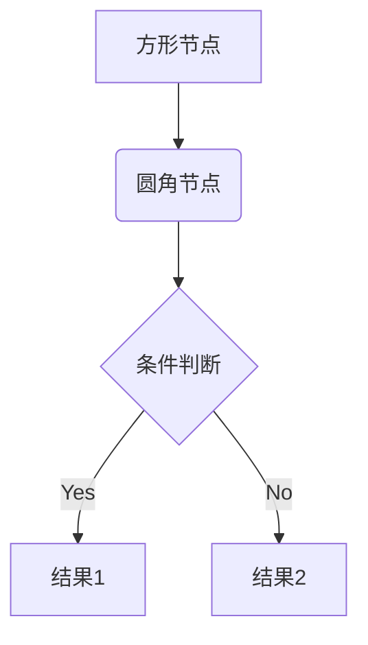

在 **VitePress + `vitepress-plugin-mermaid`** 配置好以后，你在 Markdown 里就可以直接写 **Mermaid 代码块**了。

### 基本用法

在 `.md` 文件中插入：

<pre>

</pre>

渲染结果会自动显示成图表。

---

### 支持的类型

Mermaid 支持多种图表，你在 Markdown 里只需要调整代码块的内容：

* **流程图（Flowchart）**

  ```mermaid
  flowchart LR
    A --> B --> C
  ```

* **时序图（Sequence Diagram）**

  ```mermaid
  sequenceDiagram
    Alice->>Bob: Hello Bob
    Bob-->>Alice: Hi Alice
  ```

* **甘特图（Gantt）**

  ```mermaid
  gantt
    dateFormat  YYYY-MM-DD
    title       项目进度
    section 开发
    设计       :a1, 2024-08-01, 7d
    编码       :after a1, 14d
  ```

* **类图（Class Diagram）**

  ```mermaid
  classDiagram
    class Animal {
      +String name
      +makeSound()
    }
    class Dog {
      +bark()
    }
    Animal <|-- Dog
  ```

---

### 注意事项

1. **必须是代码块写法**，语言标识是 `mermaid`。
2. 如果你的图很大，可以在 VitePress 的样式里加自定义 CSS，让图表宽度自适应。
3. GitHub Pages 部署时会一起构建，所以不需要额外配置。

---

要不要我帮你写一个 **完整的示例 `docs/index.md`**，里面包含 **公式 + Mermaid 流程图 + 目录嵌套**，你可以直接本地跑起来？
